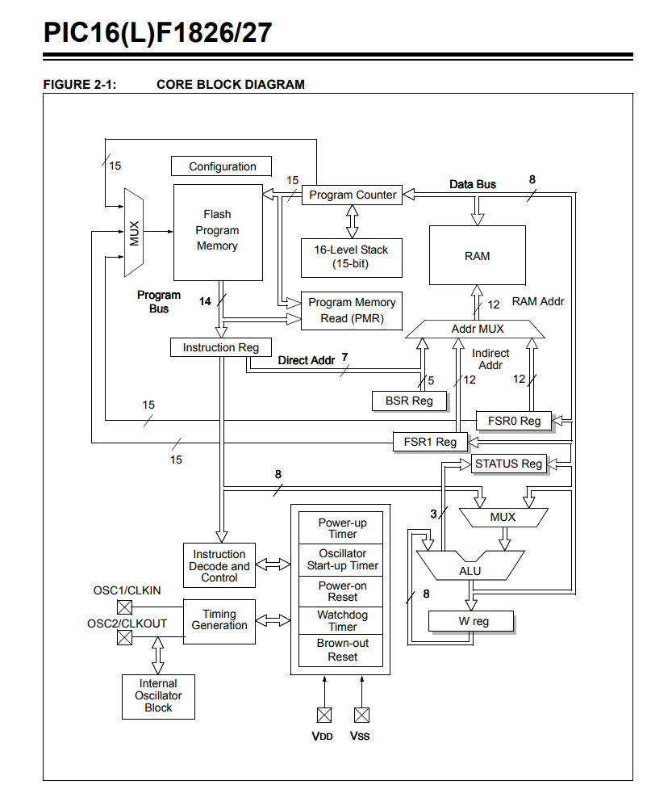

# MCU on FPGA

A microcontroller unit (MCU) implementation in Verilog designed for FPGA deployment. This project implements a simple 8-bit processor with PIC-like instruction set architecture.

## Project Overview

This project contains a complete CPU implementation with the following features:

- 8-bit data path
- 11-bit program counter and address space
- 14-bit instruction width
- Built-in RAM (128x8 bits)
- Program ROM with predefined instruction set
- Stack for subroutine calls
- Two output ports with seven-segment display drivers
- PIC-like instruction set including MOVLW, MOVWF, ADDWF, GOTO, etc.

Here is a image of the CPU architecture:  


## Architecture

### CPU Core (`cpu.v`)

The main CPU module implements:

- **Databus**: 8-bit internal data bus
- **Program Counter**: 11-bit PC with stack support
- **Instruction Register**: 14-bit instruction storage
- **ALU**: Arithmetic and logic operations
- **Memory Address Register**: For RAM addressing
- **Working Register (W)**: Primary accumulator
- **Port B & C**: Output ports for interfacing

### Memory Components

- **Program ROM** (`Program_Rom.v`): Contains the instruction memory
- **RAM** (`single_port_ram_128x8.v`): 128 locations of 8-bit data storage
- **Stack** (`Stack.v`): Hardware stack for subroutine calls

### Peripherals

- **Seven Segment Display** (`seven_segment.v`): BCD to 7-segment decoder
- **Output Ports**: Port B drives dual seven-segment displays, Port C for general I/O

## File Structure

```text
├── cpu.v                      # Main CPU module
├── Program_Rom.v              # Instruction memory
├── single_port_ram_128x8.v    # Data memory (RAM)
├── Stack.v                    # Hardware stack
├── seven_segment.v            # Seven-segment display driver
├── sim/                       # Simulation files
│   ├── test_cpu.v            # Testbench
│   ├── sim.do                # ModelSim simulation script
│   ├── compile.do            # Compilation script
│   └── wave.do               # Waveform display script
└── .gitignore                # Git ignore file
```

## Instruction Set

The CPU implements a PIC-like instruction set with 14-bit instructions:

| Instruction | Opcode | Description |
|-------------|--------|-------------|
| MOVLW k     | 30xx   | Move literal to W register |
| MOVWF f     | 00xx   | Move W to file register |
| ADDWF f     | 07xx   | Add W and file register |
| GOTO k      | 28xx   | Unconditional jump |
| INCFEQCSZ f | 34xx   | Increment file, skip if zero |

## Getting Started

### Prerequisites

- ModelSim or QuestaSim for simulation
- FPGA development tools (Quartus, Vivado, etc.) for hardware implementation
- Verilog-compatible simulator

### Simulation

1. Navigate to the simulation directory:

   ```bash
   cd sim
   ```

2. Compile the design:

   ```bash
   do compile.do
   ```

3. Run the simulation:

   ```bash
   do sim.do
   ```

4. View waveforms:

   ```bash
   do wave.do
   ```

### Hardware Implementation

1. Create a new project in your FPGA development environment
2. Add all `.v` files to the project
3. Set `cpu.v` as the top-level module
4. Assign pin constraints for:
   - `clk`: System clock input
   - `rst`: Reset input
   - `seven_seg_out1[6:0]`: First seven-segment display
   - `seven_seg_out2[6:0]`: Second seven-segment display

## Example Program

The current program in ROM performs a simple counting operation:

```assembly
MOVLW 4      ; Load 4 into W
MOVWF portc  ; Output to Port C
MOVLW 0      ; Load 0 into W
MOVWF 37     ; Store in RAM location 37
loop:
ADDWF 37     ; Add RAM[37] to W
INCFEQCSZ 37 ; Increment RAM[37], skip if zero
GOTO loop    ; Jump back to loop
MOVLW 1      ; Load 1 into W
MOVLW 2      ; Load 2 into W
GOTO $       ; Infinite loop
```

## Customization

### Adding New Instructions

1. Modify the instruction decoder in `cpu.v`
2. Update the ALU operations as needed
3. Add corresponding opcodes to `Program_Rom.v`

### Expanding Memory

- Modify the address width in RAM and ROM modules
- Update the MAR and PC widths accordingly

### Adding Peripherals

- Connect new modules to the databus
- Add control signals and address decoding
- Update the memory map documentation

## Testing

The testbench (`test_cpu.v`) provides basic functionality testing:

- Clock generation (10ns period)
- Reset sequence
- Execution observation

Extend the testbench to verify specific instruction sequences or add stimulus for comprehensive testing.

## Contributing

1. Fork the repository
2. Create a feature branch
3. Make your changes
4. Add appropriate tests
5. Submit a pull request

## License

This project is open source. Please check the repository for license details.

## Future Enhancements

- [ ] Interrupt handling
- [ ] Additional addressing modes
- [ ] Timer/Counter peripherals
- [ ] UART communication
- [ ] SPI/I2C interfaces
- [ ] Expanded instruction set (multiplication, division)
- [ ] Cache memory implementation

## Authors

Created as part of FPGA-based microcontroller development.
